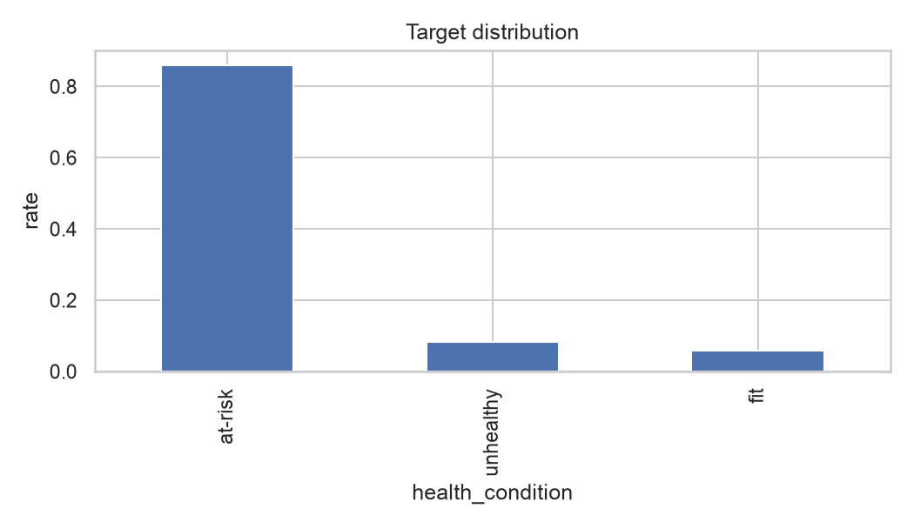
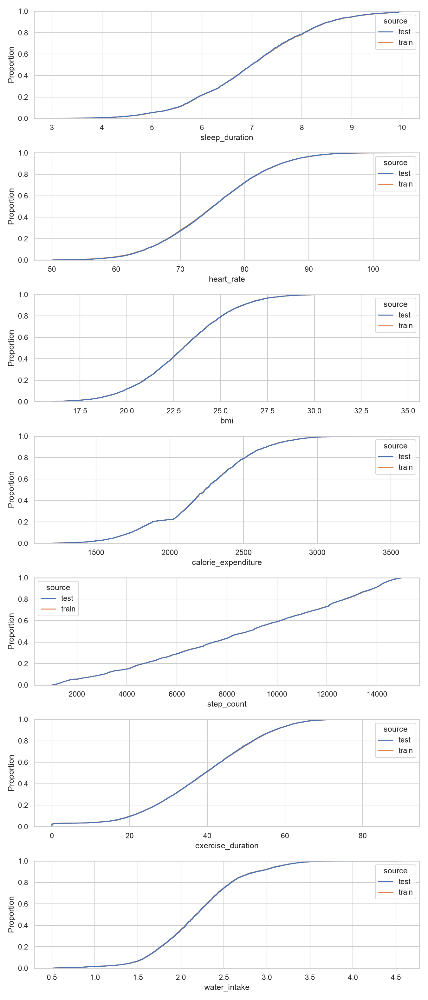
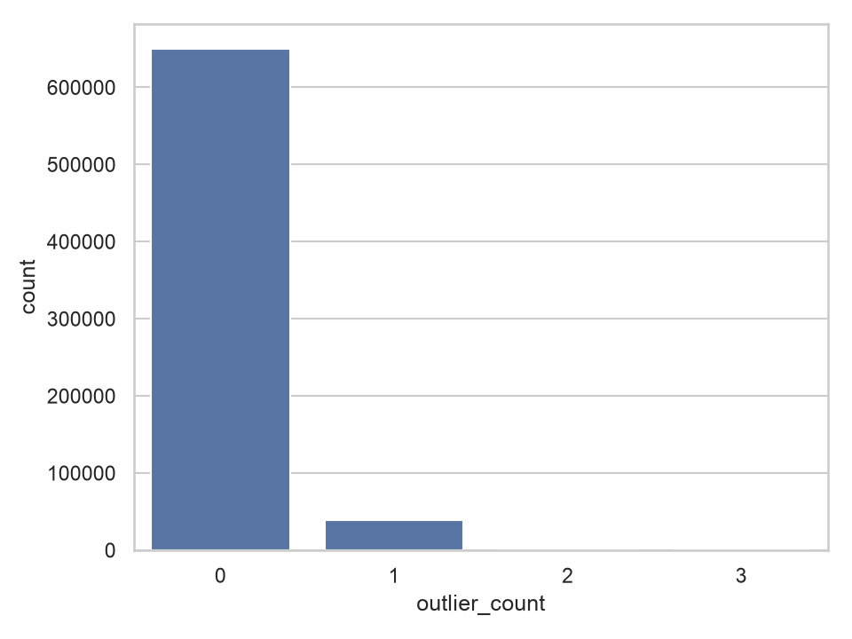
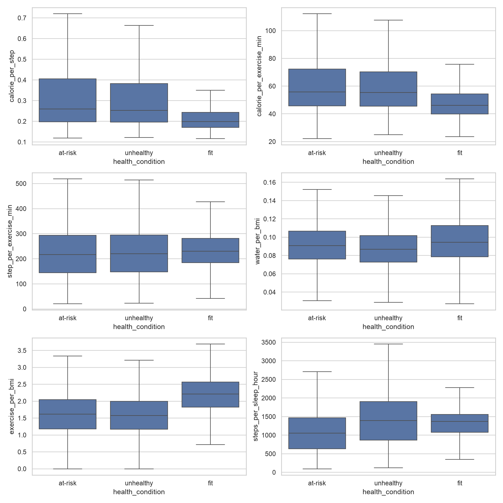

# Yönetici özeti

Bu rapor, beş EDA notebookunun temiz kernel ile yeniden çalıştırılmasıyla üretilen tüm tablo ve grafik artefaktlarını birlikte yorumlar. Amaç model seçmek değil; modelleme öncesi missing value, dağılım kayması, outlier ve feature engineering kararlarını kanıta bağlamaktır.

Öne çıkan sonuçlar:

1. **Target ciddi biçimde dengesizdir.** `at-risk` %85,87, `unhealthy` %8,36 ve `fit` %5,77 oranındadır. Gelecekte ana metrik balanced accuracy, zorunlu yardımcı metrik sınıf bazlı recall olmalıdır.
2. **Train ve test genel olarak aynı üretim sürecinden görünmektedir.** Numeric KS istatistiklerinin tamamı 0,0034'ün altındadır; missing oranları neredeyse birebir aynıdır. Belirgin tek shift `gender` dağılımındadır (TVD 0,0331).
3. **Missingness çoğu kolonda zayıf, BMI'da ise güçlü target sinyali taşır.** BMI missing satırlarda `unhealthy` oranı %2,93'e düşerken `fit` %8,20'ye çıkar. Missing flag'leri korunmalı; yalnız `missing_count` tek başına güçlü görünmemektedir.
4. **Uç değerler hata gibi değil, sınıf sınırlarının parçası gibi davranmaktadır.** Düşük uyku, yüksek BMI, düşük BMI, yüksek adım ve yüksek egzersiz uçları target dağılımını ciddi biçimde değiştirir. Satır silmek bilgi kaybına yol açabilir.
5. **En güçlü ham sinyaller** uyku süresi, BMI, adım sayısı, egzersiz süresi, stress seviyesi ve fiziksel aktivitedir. Heart rate ve water intake tek başına daha zayıftır.
6. **Preprocess V2 ilk modelleme adayıdır:** median/`missing` imputasyon + missing flag/count + ratio + kategorik interaction + train kaynaklı outlier flag. Clipping ve rule-based flag'ler ayrı ablation deneyleri olmalıdır.

# 1. Veri sözleşmesi ve kapsam

| Öğrenme seti | Satır | Kolon |
|---|---:|---:|
| Train | 690.088 | 15 |
| Test | 295.753 | 14 |

- Kimlik kolonu: `id`
- Target: `health_condition`
- Numeric feature sayısı: 7
- Kategorik feature sayısı: 6
- Train feature kolonları test ile uyumludur; testte target yoktur.
- Bütün feature kolonlarında missing değer vardır; `id` ve target eksiksizdir.
- Bu aşamada model, cross-validation veya leaderboard sonucu üretilmemiştir.

# 2. Target dağılımı

| Sınıf | Adet | Oran |
|---|---:|---:|
| at-risk | 592.561 | %85,87 |
| unhealthy | 57.724 | %8,36 |
| fit | 39.803 | %5,77 |

**Yorum:** Sadece çoğunluk sınıfını tahmin eden anlamsız bir yaklaşım yaklaşık %85,9 accuracy elde edebilir. Bu nedenle accuracy optimizasyonu yanlış yönlendirir. `fit` recall ve `unhealthy` recall özellikle izlenmeli; fold'lar target bakımından stratified kurulmalıdır.

# 3. Ham feature–target ilişkileri

## 3.1 Numeric feature'lar

| Feature | at-risk medyan | fit medyan | unhealthy medyan | Yorum |
|---|---:|---:|---:|---|
| sleep_duration | 7,03 | 7,84 | 5,53 | En net ayrımlardan biri; düşük uyku unhealthy ile ilişkili. |
| heart_rate | 75,10 | 74,50 | 75,10 | Merkezi değerlerde sınıf ayrımı zayıf. |
| bmi | 22,96 | 22,25 | 23,70 | Fit daha düşük, unhealthy daha yüksek; uçlarda ilişki çok güçleniyor. |
| calorie_expenditure | 2.235 | 2.345 | 2.255 | Fit sınıfında daha yüksek, fakat sınıflar örtüşüyor. |
| step_count | 8.483 | 12.342,5 | 8.941,5 | Fit sınıfını ayıran güçlü hareket sinyali. |
| exercise_duration | 38,60 | 50,50 | 39,70 | Fit sınıfında belirgin biçimde yüksek. |
| water_intake | 2,18 | 2,14 | 2,18 | Tek başına zayıf; oran veya uç değer olarak incelenmeli. |

**Korelasyon:** En yüksek doğrusal ilişkiler `step_count–exercise_duration` (0,438), `step_count–calorie_expenditure` (0,400) ve `exercise_duration–calorie_expenditure` (0,394) çiftlerindedir. Bunlar aynı aktivite eksenini kısmen tekrarlar, ancak GBDT için otomatik silme gerekçesi değildir. Ratio feature'ların ek değerinin ablation ile ölçülmesi gerekir.

## 3.2 Kategorik feature'lar

- `stress_level=high`: %27,87 unhealthy; `low`: %20,06 fit; `medium`: %99,39 at-risk. En güçlü kategorik sinyaldir.
- `physical_activity_level=active`: %17,16 fit. `moderate` ve `sedentary` seviyelerinde fit oranı sırasıyla yalnız %0,31 ve %0,24'tür.
- `sleep_quality=poor`: %13,58 unhealthy; `good`: %8,17 fit ve yalnız %3,05 unhealthy.
- `smoking_alcohol=yes`: %11,20 unhealthy; `no`: %7,86 fit ve %5,46 unhealthy.
- `diet_type` farkları sınırlıdır: fit oranı %5,16–%6,12 aralığındadır.
- `gender` target ile görece zayıf ilişkilidir; buna rağmen train-test shift nedeniyle encoding sağlam olmalıdır.

# 4. Missing value analizi

## 4.1 Missing oranları

| Feature | Train missing | Test missing | Train-test farkı |
|---|---:|---:|---:|
| stress_level | %12,00 | %12,00 | yaklaşık 0 |
| sleep_duration | %11,01 | %11,01 | yaklaşık 0 |
| sleep_quality | %8,45 | %8,45 | yaklaşık 0 |
| calorie_expenditure | %7,66 | %7,66 | yaklaşık 0 |
| water_intake | %6,30 | %6,30 | yaklaşık 0 |
| physical_activity_level | %5,31 | %5,31 | yaklaşık 0 |
| smoking_alcohol | %4,14 | %4,14 | yaklaşık 0 |
| gender | %3,10 | %3,10 | yaklaşık 0 |
| step_count | %2,02 | %2,02 | yaklaşık 0 |
| bmi | %2,01 | %2,01 | yaklaşık 0 |
| heart_rate | %1,14 | %1,14 | yaklaşık 0 |
| exercise_duration | %1,00 | %1,00 | yaklaşık 0 |
| diet_type | %1,00 | %1,00 | yaklaşık 0 |

Missing oranlarının train ve testte altı ondalık basamağa kadar benzer olması, shift riskinin düşük olduğunu ve missing mekanizmasının veri üretim sürecinde kontrollü olabileceğini düşündürür.

## 4.2 Missingness target sinyali

| Feature missing olduğunda | at-risk | fit | unhealthy | Değerlendirme |
|---|---:|---:|---:|---|
| bmi | %88,88 | %8,20 | %2,93 | Çok güçlü ve sıra dışı sinyal; flag zorunlu aday. |
| heart_rate | %87,08 | %5,53 | %7,39 | Orta düzey fark. |
| exercise_duration | %85,09 | %6,04 | %8,87 | Küçük fakat yönlü fark. |
| diet_type | %86,76 | %5,09 | %8,16 | Küçük fark. |
| gender | %85,83 | %5,57 | %8,60 | Küçük fark. |
| water_intake | %85,51 | %5,81 | %8,69 | Küçük fark. |
| stress_level | %85,89 | %5,75 | %8,36 | Global dağılıma çok yakın. |

`missing_count=0` olan 349.623 satırda sınıf dağılımı globale çok yakındır. Count 1–3 için de değişim küçüktür. Count 5 yalnız 87, count 6 yalnız 9 satır içerdiğinden bu seviyelerdeki oranlar güvenilir değildir.

**Karar:**

- Numeric: median imputasyon.
- Kategorik: açık `missing` seviyesi.
- Her missing kolon için `_is_missing` flag.
- `missing_count` düşük maliyetli aday olarak tutulabilir; tek başına güçlü bir sinyal olduğu varsayılmamalıdır.
- BMI missing flag'i kesinlikle ablation kapsamına alınmalıdır.

# 5. Train-test dağılım kayması

## 5.1 Numeric shift

| Feature | KS statistic | Train medyan | Test medyan | Sonuç |
|---|---:|---:|---:|---|
| water_intake | 0,00336 | 2,17 | 2,18 | Çok küçük fark. |
| step_count | 0,00235 | 8.856 | 8.857 | İhmal edilebilir. |
| heart_rate | 0,00200 | 75,10 | 75,10 | İhmal edilebilir. |
| sleep_duration | 0,00179 | 6,99 | 6,99 | İhmal edilebilir. |
| calorie_expenditure | 0,00168 | 2.241 | 2.240 | İhmal edilebilir. |
| exercise_duration | 0,00165 | 39,40 | 39,40 | İhmal edilebilir. |
| bmi | 0,00113 | 22,99 | 22,99 | İhmal edilebilir. |

Büyük örneklemde p-value aşırı hassas olabileceği için karar KS statistic ve percentile tablolarıyla verilmiştir. %0,1–%99,9 percentile değerleri de train ve test arasında çok yakındır.

## 5.2 Kategorik shift

| Feature | Total variation distance | Test-only kategori |
|---|---:|---|
| gender | 0,03309 | Yok |
| physical_activity_level | 0,00856 | Yok |
| smoking_alcohol | 0,00204 | Yok |
| sleep_quality | 0,00133 | Yok |
| stress_level | 0,00122 | Yok |
| diet_type | 0,00083 | Yok |

`gender` farkının kaynağı: female train'de %32,46 iken testte %29,15; other train'de %29,99 iken testte %33,11'dir. Male ve missing oranları stabildir. Unknown kategori bulunmaması olumlu olsa da gelecekteki encoder unknown seviyeleri güvenle ele almalıdır.

**Karar:** Adversarial validation şu an zorunlu görünmüyor; modelleme aşamasında E001 baseline sonrasında opsiyonel tanı deneyi olabilir. Gender için performansın train dağılımına aşırı bağlanmadığı kontrol edilmelidir.

# 6. Outlier analizi

## 6.1 Outlier oranları

| Feature | IQR oranı | %0,5–%99,5 quantile oranı | Not |
|---|---:|---:|---|
| sleep_duration | %0,29 | %0,84 | Alt ve üst uç target ile ilişkili. |
| heart_rate | %0,41 | %0,97 | Sınıf ayrımı daha zayıf. |
| bmi | %0,78 | %0,97 | Uçlarda çok güçlü sınıf sinyali. |
| calorie_expenditure | %1,86 | %0,91 | IQR görece agresif. |
| step_count | %0,00 | %0,96 | Bounded dağılım; IQR outlier bulmuyor. |
| exercise_duration | %0,02 | %0,49 | Alt eşik 0 olduğu için low flag üretmiyor. |
| water_intake | %1,65 | %0,89 | IQR görece agresif. |

Train'de öğrenilen quantile eşikleri testte hemen hemen aynı outlier oranlarını üretmiştir. En büyük mutlak fark düşük heart rate flag'inde yalnız 0,10 yüzde puandır. Bu da eşiklerin train-test arasında stabil olduğunu gösterir.

## 6.2 Outlier ve target

- Düşük uyku outlier'larında unhealthy %42,05; normal grupta %8,22.
- Yüksek uyku outlier'larında fit %9,56; unhealthy yalnız %0,14.
- Düşük BMI outlier'larında fit %49,62; unhealthy %0.
- Yüksek BMI outlier'larında unhealthy %68,02; fit %0.
- Yüksek step count outlier'larında fit %17,92.
- Yüksek exercise duration outlier'larında fit %17,57.
- Yüksek calorie expenditure outlier'larında fit %12,02 ve unhealthy %11,54.
- Yüksek water intake outlier'larında unhealthy %12,17.

**Karar:** Outlier silme yapılmamalıdır. Uç değerler büyük ölçüde target mekanizmasının parçasıdır. Train quantile outlier flag'leri V2'ye adaydır. Clipping ancak V3 olarak, aynı cross-validation fold'larında V2'ye karşı test edilmelidir.

# 7. Feature engineering adayları

## 7.1 Ratio feature'lar

- `exercise_per_bmi`: fit ortalaması 2,223; at-risk 1,602; unhealthy 1,570. En temiz ratio adaylarından biridir.
- `calorie_per_step`: fit medyanı 0,198; at-risk 0,259; unhealthy 0,254. Fit için daha düşük ve daha dar dağılım vardır.
- `calorie_per_exercise_min`: fit medyanı 46,24; at-risk 55,86; unhealthy 55,27. Exercise duration sıfıra yakın olduğunda üst kuyruk 2.000'in üzerine çıkar.
- `step_per_exercise_min`: fit dağılımı daha dar; at-risk/unhealthy üst kuyrukları çok uzundur.
- `water_per_bmi`: fit ortalaması 0,0968; unhealthy 0,0880. Fark vardır fakat diğer ratio'lara göre daha sınırlıdır.
- `steps_per_sleep_hour`: unhealthy medyanı 1.392,9; fit 1.364,1; at-risk 1.052,2. Unhealthy üst kuyruğu belirgindir.

**Risk:** Exercise denominator'lı ratio'larda sıfıra yakın değerler yapay uzun kuyruk oluşturur. Mevcut `+1` koruması sonsuz değeri önler; yine de ratio outlier flag veya `log1p` ablation'ı düşünülmelidir. Kör clipping yapılmamalıdır.

## 7.2 Kategorik interaction'lar

- `high__poor` stress/sleep birleşiminde unhealthy %43,24.
- `high__average` ve `high__missing` birleşimlerinde unhealthy yaklaşık %27,7.
- `low__good` birleşiminde fit %27,72; unhealthy %0,27.
- `medium__*` birleşimlerinin tamamında at-risk yaklaşık %99,4'tür.
- `active__balanced` ve `active__veg` activity/diet birleşimlerinde fit yaklaşık %18'dir.
- `no__active` smoking/activity birleşiminde fit %22,54.
- `yes__active` birleşiminde unhealthy %11,93 ve fit %11,40'tır.
- Gender/activity interaction'larında ayrımın büyük bölümü activity'den gelir; gender ek katkısı sınırlı görünür.

**Karar:** `stress_sleep_quality`, `activity_diet` ve `smoking_activity` V2 adaylarıdır. `gender_activity`, hem daha zayıf ek sinyal hem de gender shift nedeniyle ayrı ablation ile değerlendirilmelidir.

## 7.3 Rule-based flag'ler

| Flag aktifken | fit | unhealthy | Yorum |
|---|---:|---:|---|
| low_sleep `<6` | %0,23 | %36,80 | Çok güçlü unhealthy sinyali. |
| high_sleep `>9` | %11,16 | %0,32 | Fit yönlü sinyal. |
| high_bmi `>=30` | %0,00 | %83,10 | Çok güçlü unhealthy sinyali. |
| low_bmi `<18,5` | %20,34 | %0,00 | Fit yönlü sinyal. |
| high_heart_rate `>100` | %6,54 | %1,96 | Çok az gözlem olabilir; dikkatli yorumlanmalı. |
| low_heart_rate `<60` | %5,17 | %6,78 | Zayıf/orta sinyal. |
| low_steps `<3000` | %0,24 | %8,06 | Fit yokluğu belirgin. |
| high_steps `>12000` | %12,00 | %8,48 | Fit oranını artırıyor. |

Bu flag'ler target ile güçlü ilişkilidir; ancak eşiklerin bir kısmı ham feature'ın öğrenebileceği ayrımı elle tekrar eder. Bu yüzden V2'ye otomatik eklenmemeli, V2 üzerine ayrı bir rule-feature ablation deneyi olmalıdır.

# 8. Preprocessing kararı ve deney önerisi

## Preprocess V1 — güvenli baseline

- Numeric median imputasyon; değer yalnız fold-train'den öğrenilir.
- Kategorik missing seviyesi: `missing`.
- Her missing kolon için flag.
- Unknown category handling.
- Satır silme ve clipping yok.

## Preprocess V2 — önerilen ilk feature set

V1'e ek olarak:

- `missing_count`
- Altı ratio feature
- `stress_sleep_quality`, `activity_diet`, `smoking_activity`
- Train/fold-train %0,5–%99,5 eşiklerinden outlier flag'leri
- `outlier_count`

`gender_activity` ayrı ablation'da değerlendirilmelidir.

## Preprocess V3 — kontrollü clipping deneyi

- V2 + numeric ve ratio feature'larda fold-train %0,1–%99,9 clipping.
- V2'yi geçmedikçe kabul edilmemelidir.

## Önerilen ilk deney sırası

| Deney | Amaç |
|---|---|
| E001 | Preprocess V1 ile modelden bağımsız güvenli baseline sözleşmesi |
| E002 | V1 + missing_count; missing count'un marjinal katkısı |
| E003 | V1 + ratio feature'lar |
| E004 | V1 + kategorik interaction'lar |
| E005 | V1 + outlier flag/count |
| E006 | Tam V2 |
| E007 | V2 + gender_activity |
| E008 | V2 + rule-based flags |
| E009 | V3 clipping karşılaştırması |

Bu sıra model seçimini tanımlamaz; yalnız preprocessing ablation mantığını kayıt altına alır.

# 9. Riskler ve sınırlamalar

- Bulgular ilişkiseldir; nedensellik veya tıbbi geçerlilik iddiası taşımaz.
- Dataset sentetik/yarı sentetik bir üretim mekanizmasına sahip olabilir; keskin eşikler target üretim kuralını yansıtıyor olabilir.
- Target'a bakarak feature seçmek mümkündür, ancak gerçek katkı yalnız stratified cross-validation ile doğrulanmalıdır.
- Nadir alt gruplarda oranlar yanıltıcı olabilir; interaction/flag tabloları modelleme öncesinde gözlem sayısıyla birlikte filtrelenmelidir.
- KS p-value büyük örneklemde tek başına karar ölçütü değildir.
- Test distribution'a bakmak preprocessing sözleşmesini sağlamlaştırmak içindir; target bilgisi olmadığı için performans garantisi vermez.

# 10. Artefakt kataloğu

## Grafikler

| Artefakt | İçerik |
|---|---|
| `01_target_distribution.png` | Target sınıf oranları |
| `03_numeric_shift_ecdf.png` | Numeric train-test ECDF karşılaştırmaları |
| `04_outlier_count.png` | Satır başına outlier sayısı |
| `05_ratio_by_target.png` | Ratio feature'ların target bazlı boxplotları |

## Tablolar

| Artefakt | İçerik |
|---|---|
| `01_target_distribution.csv` | Target adet ve oranları |
| `02_missing_summary.csv` | Train/test missing oranları ve farkları |
| `02_missingness_target.csv` | Her missing flag için sınıf dağılımı |
| `02_missing_count_target.csv` | Satır başına missing sayısı ve target oranları |
| `03_numeric_shift.csv` | Mean, median, std ve KS sonuçları |
| `03_numeric_percentiles.csv` | Train/test %0,1–%99,9 percentile değerleri |
| `03_categorical_shift.csv` | TVD, unique ve unseen category sonuçları |
| `04_outlier_summary.csv` | IQR ve quantile outlier eşikleri/oranları |
| `04_train_test_outlier_rates.csv` | Train kaynaklı eşiklerin train/test oranları |
| `04_outlier_target.csv` | Outlier flag ve target ilişkisi |
| `05_ratio_target_summary.csv` | Ratio feature'ların sınıf bazlı dağılımı |
| `05_interaction_target.csv` | Kategorik interaction target oranları |
| `05_rule_target.csv` | Rule-based flag target oranları |

# 11. Son karar günlüğü

- **Kabul:** Balanced accuracy + sınıf bazlı recall değerlendirme standardı.
- **Kabul:** Satır silmeme.
- **Kabul:** Numeric median, kategorik `missing`, unknown handling ve missing flag içeren V1.
- **Kabul:** BMI missing flag'ini zorunlu aday olarak değerlendirme.
- **Aday:** Ratio, seçilmiş interaction ve outlier flag içeren V2.
- **Aday:** `gender_activity` ve rule-based flag'leri ayrı ablation olarak test etme.
- **Aday:** V3 clipping; yalnız V2'ye karşı doğrulanırsa kabul.
- **Red:** IQR ile otomatik outlier silme.
- **Red:** Accuracy'yi tek performans metriği olarak kullanma.
