# Yönetici özeti

Bu rapor, tamamlanan **7 ana model deneyi**, **4 OOF class-multiplier optimizasyonu** ve
**20 LightGBM sweep trial'ını** submission seçimi için tek karar paketinde toplar. Bütün
skorlar train etiketlerinden üretilen out-of-fold (OOF) tahminlere dayanır; test etiketi
ve public leaderboard bilgisi optimizasyonda kullanılmamıştır.

En önemli sonuçlar:

1. **En iyi doğrudan argmax model E008:** balanced accuracy
   `0.914002 ± 0.001098`. Sqrt-balanced sample
   weight, E002'ye göre `+0.037065`
   kazandırmıştır.
2. **En iyi tuned OOF sonucu E002:** `0.948584`.
   Class multiplier tuning dört kaynak modelin tamamını yaklaşık 0,948 seviyesine taşımıştır.
3. **En iyi sweep SWEEP_002:** `0.877851`; E002'ye
   göre yalnız `+0.000915` ve E001'e
   göre `-0.000252` fark üretmiştir.
   Sweep, sınıf ağırlığı kadar güçlü bir kazanım sağlamamıştır.
4. **Submission seçimindeki ana belirsizlik multiplier overfit riskidir.** Aynı OOF üzerinde
   multiplier seçilip skorlandığı için tuned skorlar bağımsız doğrulama skoru değildir.
5. **Karar için güvenli kısa liste:** E008 argmax, E002 tuned, E006 tuned, E008 tuned ve
   çeşitlilik kontrolü için SWEEP_002 argmax. İlk gönderimlerde argmax/tuned
   çifti, postprocess'in gerçek leaderboard katkısını ölçmek için birlikte değerlendirilebilir.

# 1. Kapsam, veri ve tekrar üretilebilirlik

| Alan | Değer |
|---|---|
| Train satırı | 690,088 |
| Test satırı | 295,753 |
| Ham feature | 13 (7 numeric + 6 categorical) |
| Target | `health_condition` |
| Sınıflar | `at-risk`, `fit`, `unhealthy` |
| CV | StratifiedKFold, 3 fold, shuffle, seed 42 |
| Model | LightGBM 4.6.0, CPU/OpenMP, `n_jobs=6` |
| Python | 3.12.7 |
| Train SHA-256 | `424d744d0344b14b7888b901d79db536f6ffbe73229809a736247ff812416fed` |
| Test SHA-256 | `34914866109ab01c806adc25634fef1639d7574368a13d48ebe3037367365e01` |

Gerçek train sınıf dağılımı:

| Sınıf | Adet | Oran |
|---|---:|---:|
| at-risk | 592,561 | %85,87 |
| fit | 39,803 | %5,77 |
| unhealthy | 57,724 | %8,36 |

Bu dengesizlik nedeniyle normal accuracy ana seçim metriği değildir. Balanced accuracy,
üç sınıf recall değerinin ortalamasıdır ve azınlık sınıflarını eşit ağırlıkla değerlendirir.

# 2. Pipeline nasıl çalıştı?

```text
CSV yükleme ve schema doğrulama
  -> stratified 3-fold ayırma
  -> her fold'da yalnız fold-train ile preprocessing fit
  -> LightGBM + early stopping
  -> fold-valid OOF probabilities
  -> fold-test probabilities ve üç fold ortalaması
  -> metrikler, modeller, importance, confusion matrix, ROC, manifest
  -> seçili deneylerde OOF-only class multiplier tuning
  -> argmax ve tuned submission üretimi
  -> E002 feature pipeline üzerinde 20 trial parameter sweep
```

## 2.1 Fold-safe preprocessing

Median, kategori seviyeleri, outlier quantile ve clipping sınırları yalnız fold-train'de
öğrenilir. Aynı dönüşüm fold-valid ve test'e uygulanır. Bu tasarım validation satırlarının
kendi preprocessing istatistiklerini etkilemesini, yani veri sızıntısını önler.

## 2.2 LightGBM ve early stopping

Başlangıç modeli `learning_rate=0.035`, `num_leaves=96`, `min_child_samples=200`,
`subsample=0.85`, `colsample_bytree=0.90`, `reg_alpha=0.1`, `reg_lambda=2.0` kullanır.
`n_estimators=12000` yalnız üst sınırdır. Validation multi-logloss 300 tur iyileşmezse
eğitim durur ve her fold'un en iyi iterasyonu kullanılır.

## 2.3 OOF ve test olasılıkları

Her train satırının OOF olasılığı, o satırı eğitimde görmeyen modelden gelir. Model seçimi,
multiplier tuning ve rapordaki lokal metrikler bu olasılıklar üzerinden hesaplanır. Test
olasılıkları üç fold modelinin ortalamasıdır.

# 3. Deney tasarımı: ne değiştirildi?

| Deney | Pipeline | Değişiklik | Ölçülen hipotez |
|---|---|---|---|
| E001 | V1 baseline | Median + missing category/flag | Güvenli referans |
| E002 | V2-Core | Missing count, 6 ratio, 3 interaction, outlier flag/count | EDA feature set'i ek sinyal taşıyor mu? |
| E003 | E002 + interaction | `gender_activity` | Gender/activity birlikte yararlı mı? |
| E004 | E002 + rules | 8 threshold flag | Açık eşikler rare-class recall artırıyor mu? |
| E005 | E002 + clipping | Fold-train %0,1/%99,9 clipping | Uç değer sıkıştırma genellemeyi artırıyor mu? |
| E006 | E002 + log | 6 `log1p(ratio)` | Uzun kuyrukları sıkıştırmak yararlı mı? |
| E007 | Postprocess | OOF class multiplier | Argmax karar sınırı dengelenebilir mi? |
| E008 | E002 + weight | Sqrt-balanced sample weight | Rare class eğitim ağırlığı faydalı mı? |

Feature yöntemlerinin formülleri ve sayısal örnekleri ayrıca
[`experiments-detailed-explanation.md`](experiments-detailed-explanation.md) belgesinde
ayrıntılı olarak açıklanmıştır.

## 3.1 Feature üretim yöntemleri ve tam eşikler

### Missing yönetimi

- 7 numeric kolon fold-train medianı ile doldurulur.
- 6 categorical kolon için eksik değer açık `missing` kategorisidir.
- Her ham kolon için `<kolon>_is_missing` ikili flag'i üretilir.
- E002 ve türevlerinde 13 ham kolondaki eksiklerin toplamı `missing_count` olur.
- Fold-train'de görülmeyen kategoriler `__UNKNOWN__` seviyesine taşınır.

### Ratio feature'ları

Bütün oranlarda güvenli bölme `pay / (payda + 1)` kullanılır. `+1`, paydanın sıfır olduğu
satırlarda sonsuz değer oluşmasını önler.

| Feature | Formül | Amaç |
|---|---|---|
| `calorie_per_step` | calorie_expenditure / (step_count + 1) | Adım başına enerji |
| `calorie_per_exercise_min` | calorie_expenditure / (exercise_duration + 1) | Egzersiz süresine göre enerji |
| `step_per_exercise_min` | step_count / (exercise_duration + 1) | Egzersiz süresine göre hareket |
| `water_per_bmi` | water_intake / (bmi + 1) | BMI'a göre su tüketimi |
| `exercise_per_bmi` | exercise_duration / (bmi + 1) | BMI'a göre egzersiz |
| `steps_per_sleep_hour` | step_count / (sleep_duration + 1) | Uyku süresine göre hareket |

### Categorical interaction'lar

`stress_level__sleep_quality`, `physical_activity_level__diet_type` ve
`smoking_alcohol__physical_activity_level` birleşimleri yeni kategori olarak üretilir.
E003 ayrıca `gender__physical_activity_level` ekler.

### Outlier ve clipping eşikleri

- E002 outlier flag sınırları fold-train `%0,5` ve `%99,5` quantile'larıdır.
- Ham 7 numeric ve 6 ratio için `_outlier_low`/`_outlier_high` flag'leri üretilir.
- Aktif flag sayısı `outlier_count` olarak tutulur; satır silinmez.
- E005 clipping sınırları fold-train `%0,1` ve `%99,9` quantile'larıdır.
- Outlier flag clipping'den **önce** hesaplanır; uçta olma bilgisi korunur.

### Rule flag eşikleri

| Flag | Aktif olma koşulu |
|---|---|
| `low_sleep_flag` | sleep_duration < 6 |
| `high_sleep_flag` | sleep_duration > 9 |
| `high_bmi_flag` | bmi >= 30 |
| `low_bmi_flag` | bmi < 18,5 |
| `high_heart_rate_flag` | heart_rate > 100 |
| `low_heart_rate_flag` | heart_rate < 60 |
| `low_steps_flag` | step_count < 3.000 |
| `high_steps_flag` | step_count > 12.000 |

### Log dönüşümü ve sample weight

E006, her ratio için `log(1 + max(ratio, 0))` varyantını orijinal feature'ı silmeden ekler.
E008 sınıf ağırlığını fold-train sınıf sayısından hesaplar:

```text
balanced_weight(class) = N / (3 * class_count)
sqrt_balanced_weight(class) = sqrt(balanced_weight(class))
```

Bu yöntem rare-class hatalarını eğitim loss'unda daha pahalı yapar fakat tam balanced
weight'e göre çoğunluk sınıfını daha az baskılar.

# 4. Ana deney sonuçları

| experiment | değişiklik                                      | features | balanced_accuracy | std      | macro_f1 | recall_at-risk | recall_fit | recall_unhealthy | best_iteration | Δ E001    |
| --- | --- | --- | --- | --- | --- | --- | --- | --- | --- | --- |
| E001       | Median imputasyon + missing flag                | 26       | 0.878103          | 0.001471 | 0.910199 | 0.991208       | 0.832400   | 0.810703         | 286.7          | 0.000000  |
| E002       | Missing count, ratio, interaction, outlier flag | 63       | 0.876937          | 0.001883 | 0.909556 | 0.991228       | 0.829988   | 0.809594         | 242.0          | -0.001167 |
| E003       | E002 + gender_activity interaction              | 64       | 0.876819          | 0.001484 | 0.909159 | 0.991042       | 0.829510   | 0.809906         | 242.7          | -0.001284 |
| E004       | E002 + sekiz eşik flag'i                        | 71       | 0.877466          | 0.001418 | 0.909695 | 0.991127       | 0.830515   | 0.810755         | 242.3          | -0.000638 |
| E005       | E002 + %0,1/%99,9 clipping                      | 63       | 0.876661          | 0.001735 | 0.909403 | 0.991240       | 0.829133   | 0.809611         | 239.7          | -0.001442 |
| E006       | E002 + altı log1p ratio                         | 69       | 0.876852          | 0.001698 | 0.909415 | 0.991184       | 0.829812   | 0.809559         | 241.7          | -0.001252 |
| E008       | E002 + sqrt-balanced sample weight              | 63       | 0.914002          | 0.001098 | 0.904713 | 0.975356       | 0.887395   | 0.879253         | 1369.3         | 0.035898  |

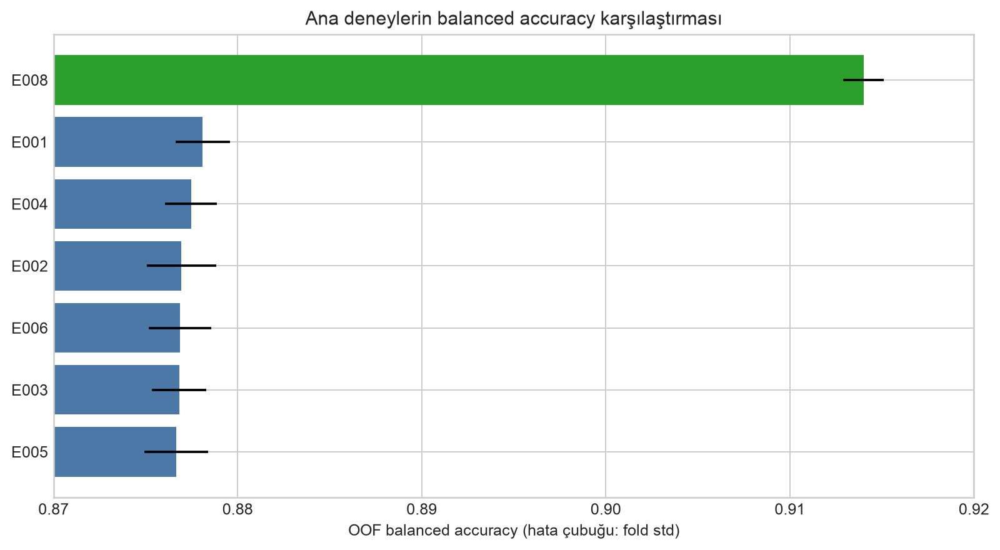

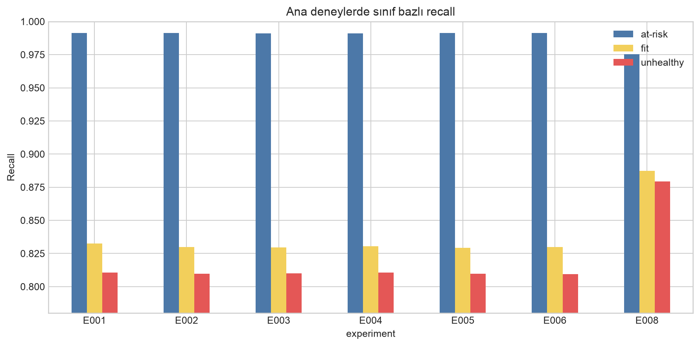

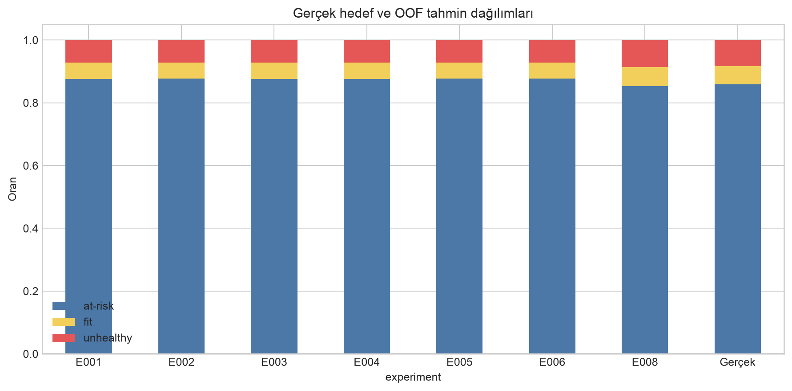

## 4.1 Fold kararlılığı

| Deney | Fold 0   | Fold 1   | Fold 2   |
| --- | --- | --- | --- |
| E001  | 0.877880 | 0.879673 | 0.876757 |
| E002  | 0.877184 | 0.878684 | 0.874942 |
| E003  | 0.876783 | 0.878322 | 0.875354 |
| E004  | 0.877834 | 0.878663 | 0.875900 |
| E005  | 0.876932 | 0.878245 | 0.874807 |
| E006  | 0.876850 | 0.878551 | 0.875154 |
| E008  | 0.912759 | 0.914842 | 0.914404 |

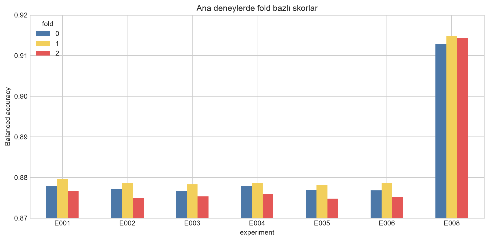

E008 yalnız ortalamada en iyi değildir; fold standard deviation değeri de ana deneylerin
en düşüğüdür. `unhealthy` recall fold'lar arasında diğer sınıflardan daha fazla oynasa da
üç fold'un tamamında E001/E002 seviyesinin belirgin üzerindedir.

## 4.2 Deney bazında kararlar

- **E001:** Güçlü baseline. 26 feature ile bütün ağırlıksız V2 varyantlarını geçmiştir.
- **E002:** EDA feature paketinin toplu eklenmesi `-0.001167` kayıp üretmiştir. Tek tek
  feature'ların kötü olduğunu kanıtlamaz; paket olarak faydalı değildir.
- **E003:** Gender/activity interaction E002'yi geçmemiştir; gender shift riski karşılığında
  kazanım yoktur.
- **E004:** E002'ye `+0.000529` ile ağırlıksız V2 varyantlarının en iyisidir; fark gürültü
  eşiğinin altındadır ve E001'i geçmez.
- **E005:** Clipping skoru düşürmüştür. Uç değerlerin hedef sinyalini taşıdığı EDA bulgusuyla
  uyumludur.
- **E006:** Log ratio varyantları pratik olarak nötrdür; 6 ek feature karşılığında kazanım yoktur.
- **E008:** Açık kazanan argmax modeldir. Rare-class recall artışı ortalama skoru yaklaşık
  0,037 yükseltmiştir.

# 5. E008 ayrıntılı teşhis

E008 overall accuracy `0.962244`, balanced accuracy
`0.914002`, macro F1 `0.904713`, MCC
`0.852788`, log-loss `0.097448` ve macro OvR ROC-AUC
`0.982905` üretmiştir.

## 5.1 Confusion matrix

| Gerçek sınıf | at-risk | fit   | unhealthy |
| --- | --- | --- | --- |
| at-risk      | 577958  | 5945  | 8658      |
| fit          | 4351    | 35321 | 131       |
| unhealthy    | 6877    | 93    | 50754     |

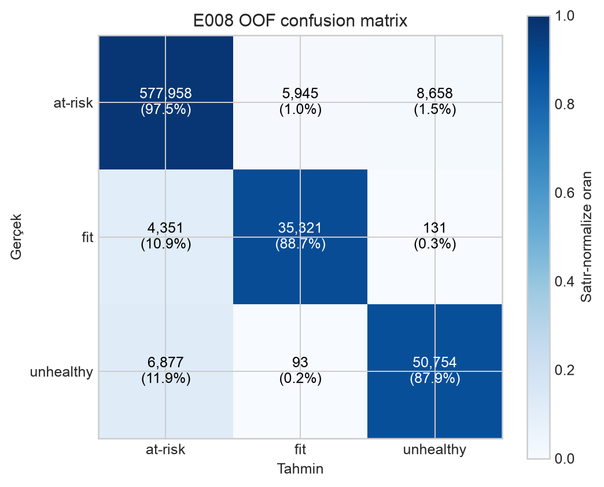

`fit` örneklerinin büyük bölümü doğru bulunurken 4.351 tanesi `at-risk` tahmin edilmiştir.
`unhealthy` için ana hata yönü yine `at-risk` sınıfıdır (6.877 satır). Bu davranış sonraki
postprocess'in neden azınlık sınıfı multiplier'larını büyüttüğünü açıklar.

## 5.2 Feature importance

| feature                   | importance_gain | importance_split |
| --- | --- | --- |
| sleep_duration            | 2,291,532       | 28,169           |
| stress_level              | 1,727,830       | 1,254            |
| stress_sleep_quality      | 1,425,269       | 19,206           |
| physical_activity_level   | 710,284         | 245              |
| activity_diet             | 505,896         | 11,995           |
| bmi                       | 224,809         | 34,328           |
| sleep_duration_is_missing | 194,984         | 1,191            |
| smoking_activity          | 156,925         | 12,435           |
| stress_level_is_missing   | 147,586         | 872              |
| steps_per_sleep_hour      | 144,854         | 21,121           |
| step_count                | 117,190         | 19,768           |
| heart_rate                | 113,610         | 34,576           |
| calorie_expenditure       | 94,144          | 28,666           |
| water_intake              | 93,704          | 26,762           |
| water_per_bmi             | 85,159          | 26,205           |
| exercise_per_bmi          | 78,575          | 20,776           |
| exercise_duration         | 77,376          | 20,102           |
| calorie_per_exercise_min  | 77,247          | 23,304           |
| step_per_exercise_min     | 76,632          | 23,005           |
| calorie_per_step          | 73,132          | 21,784           |

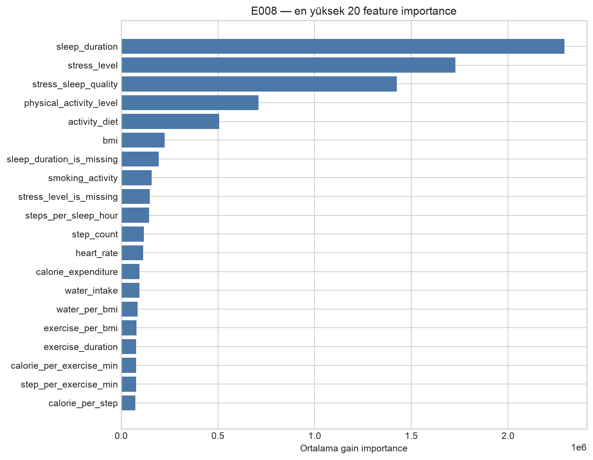

Gain importance nedensellik değildir ve korelasyonlu feature'lar önemi paylaşabilir.
Bununla birlikte `sleep_duration`, `stress_level` ve `physical_activity_level` ana sinyal
kaynaklarıdır. Missing flag ve engineered feature katkıları ham feature'ların gölgesindedir.

## 5.3 ROC ve eğitim geçmişi

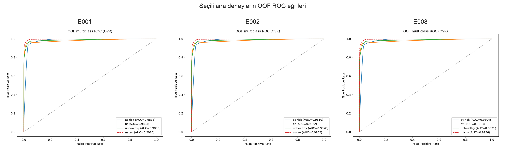

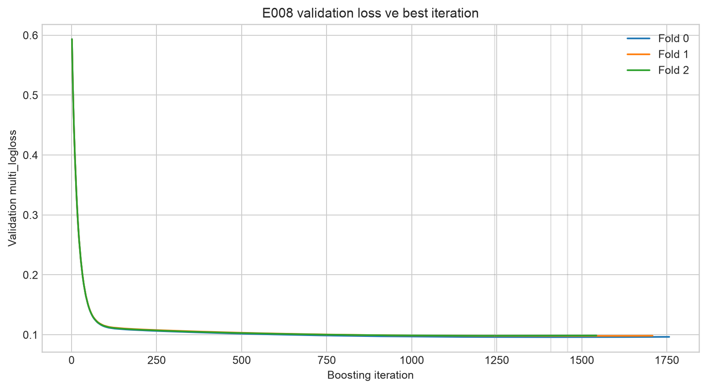

ROC-AUC sınıfların olasılık sıralamasını, balanced accuracy ise seçilen kararın recall
dengesini ölçer. E008 macro OvR ROC-AUC değeri yüksek olduğu için model olasılıklarının
sıralama gücü vardır; multiplier tuning bu sıralamayı farklı karar sınırına çevirir.
Training history'deki dikey çizgiler fold best-iteration noktalarını gösterir.

# 6. E007 — Class multiplier / karar sınırı optimizasyonu

Varsayılan karar `argmax(probability)` iken tuned karar şöyledir:

```text
prediction = argmax(probability * class_multiplier)
```

Arama, `at-risk=1` referansıyla `fit` ve `unhealthy` için 0,80–1,50 coarse grid (841 aday),
ardından en iyi komşulukta seeded 2.000 random trial uygular. Son vektör ortalaması 1 olacak
şekilde normalize edilir.

| experiment | argmax   | tuned    | delta    | macro_f1 | recall_at-risk | recall_fit | recall_unhealthy | mult_at-risk | mult_fit | mult_unhealthy |
| --- | --- | --- | --- | --- | --- | --- | --- | --- | --- | --- |
| E002       | 0.876937 | 0.948584 | 0.071648 | 0.874625 | 0.942892       | 0.945356   | 0.957505         | 0.189230     | 1.444453 | 1.366317       |
| E004       | 0.877466 | 0.948188 | 0.070722 | 0.875702 | 0.943705       | 0.944150   | 0.956708         | 0.201875     | 1.383380 | 1.414746       |
| E006       | 0.876852 | 0.948308 | 0.071456 | 0.875199 | 0.943359       | 0.944753   | 0.956812         | 0.196463     | 1.413557 | 1.389980       |
| E008       | 0.914002 | 0.947802 | 0.033800 | 0.872550 | 0.941351       | 0.943371   | 0.958683         | 0.226480     | 1.350305 | 1.423215       |

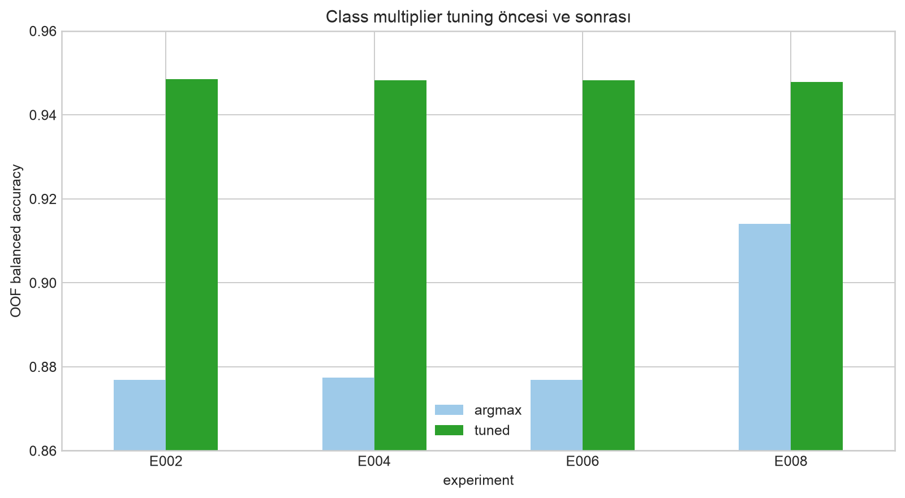

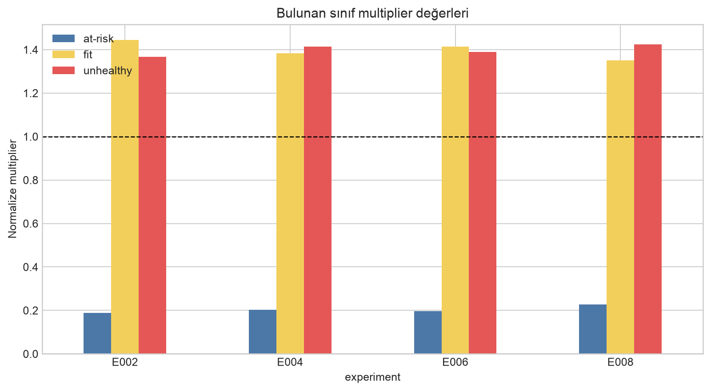

## 6.1 Kritik metodolojik uyarı

Multiplier aynı OOF tahminleri üzerinde hem **seçilmiş** hem **raporlanmıştır**. 2.841 aday
arasından en iyiyi seçmek, OOF skoruna seçim yanlılığı ekleyebilir. Bu nedenle `0.948584`
bağımsız bir holdout skoru gibi kabul edilmemelidir. Güvenilirlik sırası:

1. Aynı multiplier'ı farklı seed OOF tahminlerinde doğrulamak.
2. Nested CV ile her dış fold için multiplier'ı yalnız diğer fold'larda seçmek.
3. Public LB'de bir argmax/tuned çiftini kontrollü karşılaştırmak.

Tuned adaylar arasında fark yalnız yaklaşık 0,0008'dir; tek başına bu sıralama kesin model
üstünlüğü sayılmaz.

# 7. LightGBM sweep sonuçları

Sweep yalnız E002 feature pipeline üzerinde çalışmıştır; E008'in sample weighting yaklaşımı
sweep'e dahil değildir. Aşağıdaki tablo 20 trial'ın tamamını OOF balanced accuracy'ye göre
sıralar.

| rank | experiment | balanced_accuracy | std      | learning_rate | num_leaves | min_child_samples | reg_alpha | reg_lambda | subsample | colsample_bytree | best_iteration |
| --- | --- | --- | --- | --- | --- | --- | --- | --- | --- | --- | --- |
| 1    | SWEEP_002  | 0.877851          | 0.001796 | 0.04          | 127        | 200               | 0.0       | 10.0       | 0.85      | 0.95             | 195.0          |
| 2    | SWEEP_000  | 0.877651          | 0.001627 | 0.02          | 127        | 400               | 0.05      | 2.0        | 0.95      | 0.75             | 446.0          |
| 3    | SWEEP_003  | 0.877638          | 0.001237 | 0.03          | 31         | 800               | 0.5       | 5.0        | 0.85      | 1.0              | 444.7          |
| 4    | SWEEP_011  | 0.877442          | 0.001176 | 0.02          | 96         | 400               | 0.5       | 2.0        | 0.75      | 1.0              | 391.3          |
| 5    | SWEEP_015  | 0.877432          | 0.001984 | 0.05          | 127        | 400               | 0.05      | 5.0        | 0.75      | 1.0              | 140.3          |
| 6    | SWEEP_017  | 0.877399          | 0.001329 | 0.02          | 96         | 400               | 0.1       | 2.0        | 0.95      | 0.95             | 435.0          |
| 7    | SWEEP_012  | 0.877287          | 0.001695 | 0.04          | 127        | 50                | 0.05      | 5.0        | 0.95      | 0.85             | 201.0          |
| 8    | SWEEP_007  | 0.877255          | 0.001893 | 0.05          | 127        | 50                | 0.05      | 2.0        | 0.85      | 0.75             | 176.7          |
| 9    | SWEEP_005  | 0.877240          | 0.001091 | 0.02          | 191        | 800               | 0.05      | 5.0        | 0.75      | 1.0              | 343.0          |
| 10   | SWEEP_013  | 0.877229          | 0.001078 | 0.05          | 191        | 100               | 0.5       | 1.0        | 0.75      | 0.95             | 121.3          |
| 11   | SWEEP_001  | 0.877188          | 0.001641 | 0.04          | 63         | 50                | 0.1       | 10.0       | 0.95      | 1.0              | 232.7          |
| 12   | SWEEP_014  | 0.877127          | 0.001357 | 0.04          | 31         | 800               | 0.0       | 10.0       | 0.75      | 1.0              | 293.7          |
| 13   | SWEEP_016  | 0.877116          | 0.001457 | 0.04          | 96         | 200               | 0.1       | 0.5        | 0.75      | 0.75             | 230.0          |
| 14   | SWEEP_004  | 0.877107          | 0.001424 | 0.04          | 96         | 200               | 0.0       | 0.5        | 0.85      | 1.0              | 205.3          |
| 15   | SWEEP_006  | 0.877017          | 0.001423 | 0.04          | 63         | 50                | 0.5       | 2.0        | 0.95      | 0.95             | 257.0          |
| 16   | SWEEP_018  | 0.877014          | 0.001742 | 0.02          | 127        | 200               | 0.1       | 2.0        | 0.85      | 0.75             | 436.0          |
| 17   | SWEEP_019  | 0.876863          | 0.001682 | 0.04          | 127        | 100               | 0.1       | 0.5        | 0.85      | 0.85             | 211.7          |
| 18   | SWEEP_009  | 0.876746          | 0.001288 | 0.05          | 96         | 100               | 0.5       | 1.0        | 0.75      | 0.85             | 155.7          |
| 19   | SWEEP_008  | 0.876665          | 0.001073 | 0.04          | 31         | 400               | 0.1       | 10.0       | 0.95      | 0.85             | 345.7          |
| 20   | SWEEP_010  | 0.876204          | 0.000936 | 0.05          | 31         | 200               | 0.0       | 5.0        | 0.85      | 0.85             | 272.3          |

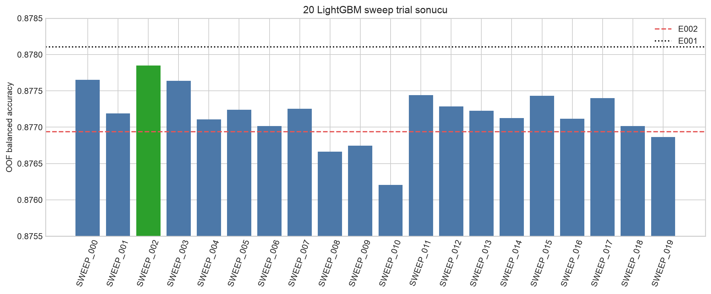

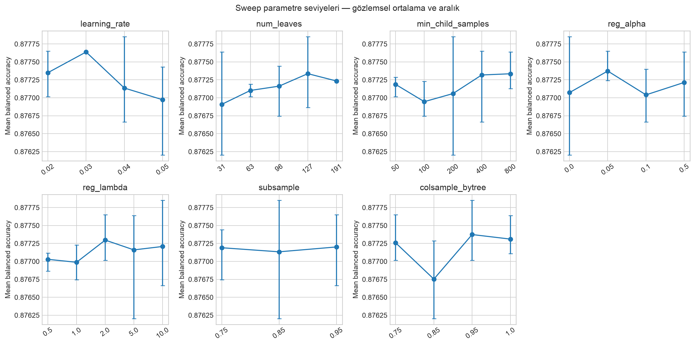

Parametre grafiği kontrollü tek-değişken deneyi değildir: her trial aynı anda birden fazla
parametreyi değiştirdiği için noktalar nedensel etki olarak okunmamalıdır. Yalnız arama
uzayında hangi seviyelerin daha iyi trial'larla birlikte görüldüğünü özetler.

## 7.1 Sweep yorumu

- En iyi trial **SWEEP_002**, parametreleri:
  `learning_rate=0.04`, `num_leaves=127`,
  `min_child_samples=200`, `reg_alpha=0.0`,
  `reg_lambda=10.0`, `subsample=0.85`,
  `colsample_bytree=0.95`.
- En iyi ile en kötü sweep arasındaki aralık yalnız
  `0.001647`'dır.
- Hiçbir sweep E008'e yaklaşmamıştır.
- Aynı 3 fold üzerinde 20 aday seçildiği için en iyi trial skoru da hafif seçim yanlılığı
  taşıyabilir.
- Sonraki HPO, yapılacaksa E008 veya E001+sqrt-balanced tabanı üzerinde ve ayrı seed ile
  doğrulanmalıdır.

# 8. Submission adaylarının doğrulanması

| candidate        | file                                                | rows   | at-risk | fit   | unhealthy | labels_valid | id_unique |
| --- | --- | --- | --- | --- | --- | --- | --- |
| E001_argmax      | outputs/experiments/E001/submission_argmax.csv      | 295753 | %87,82  | %5,12 | %7,06     | True         | True      |
| E002_argmax      | outputs/experiments/E002/submission_E002_argmax.csv | 295753 | %87,87  | %5,09 | %7,05     | True         | True      |
| E002_tuned       | outputs/experiments/E002/submission_E002_tuned.csv  | 295753 | %81,68  | %7,20 | %11,12    | True         | True      |
| E004_tuned       | outputs/experiments/E004/submission_E004_tuned.csv  | 295753 | %81,77  | %7,15 | %11,07    | True         | True      |
| E006_tuned       | outputs/experiments/E006/submission_E006_tuned.csv  | 295753 | %81,74  | %7,17 | %11,09    | True         | True      |
| E008_argmax      | outputs/experiments/E008/submission_E008_argmax.csv | 295753 | %85,50  | %5,95 | %8,56     | True         | True      |
| E008_tuned       | outputs/experiments/E008/submission_E008_tuned.csv  | 295753 | %81,46  | %7,19 | %11,35    | True         | True      |
| SWEEP_002_argmax | outputs/experiments/SWEEP_002/submission_argmax.csv | 295753 | %87,82  | %5,10 | %7,09     | True         | True      |

Bütün kısa liste dosyaları 295.753 satır, benzersiz ID, doğru iki kolon ve izin verilen üç
label kontrolünü geçmiştir.

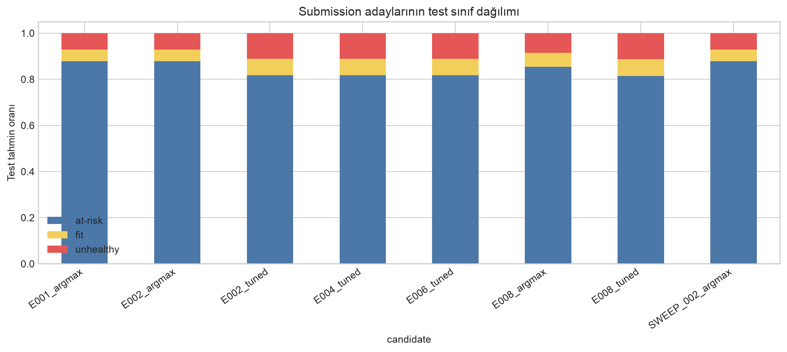

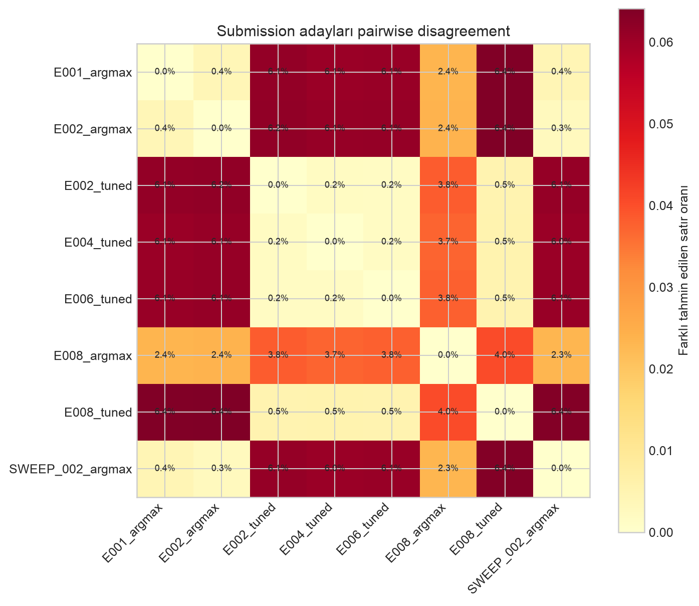

## 8.1 Disagreement nasıl okunur?

Pairwise disagreement, iki submission'ın farklı label verdiği test satırı oranıdır. Düşük
oran iki dosyanın günlük submit hakkı açısından birbirini tekrar ettiğini; daha yüksek oran
ise farklı karar sınırı veya model davranışı taşıdığını gösterir. Fakat çeşitlilik tek başına
kalite kanıtı değildir.

En yüksek kısa-liste disagreement:
`E002_argmax` ile
`E008_tuned` arasında
`6.41%`.

# 9. Submission seçimi için karar matrisi

| Aday | Güçlü yön | Ana risk | Önerilen rol |
|---|---|---|---|
| E008 argmax | En iyi bağımsız ana deney skoru, düşük fold std | Tuned modellere göre düşük OOF skor | Güvenli ilk referans |
| E002 tuned | En iyi tuned OOF skoru | Multiplier seçim yanlılığı | Ana tuned aday |
| E006 tuned | E002 tuned'a çok yakın, farklı feature set | Log feature katkısı kanıtlanmadı | İkinci tuned aday |
| E008 tuned | En yüksek unhealthy recall | E002 tuned'dan düşük, postprocess overfit | Recall-ağırlıklı aday |
| SWEEP_002 argmax | En iyi HPO trial | E001'den iyi değil | HPO kontrol adayı |
| E001 argmax | En güçlü sade ağırlıksız baseline | Rare-class recall düşük | Baseline kontrolü |

## 9.1 Önerilen kontrollü submit sırası

Bu sıra lokal kanıta dayanır; yarışma leaderboard sonucu bilinmeden kesin kazanan iddiası
değildir.

1. `outputs/experiments/E008/submission_E008_argmax.csv`
2. `outputs/experiments/E002/submission_E002_tuned.csv`
3. `outputs/experiments/E008/submission_E008_tuned.csv`
4. `outputs/experiments/E006/submission_E006_tuned.csv`
5. Gerekirse `SWEEP_002/submission_argmax.csv`

İlk iki dosya, eğitimde sınıf ağırlığı ile postprocess karar sınırının leaderboard'daki
gerçek katkısını ayırmak için en bilgi verici çifttir. Birbirine çok yakın tuned varyantların
tamamını aynı gün göndermek yerine sonuç geldikçe sonraki aday seçilmelidir.

# 10. Bilinen riskler ve eksik doğrulamalar

1. **Tek CV seed:** Bütün ana deneyler seed 42 ile aynı üç fold'u kullanır.
2. **Multiplier overfit:** Class multiplier aynı OOF üzerinde seçilip değerlendirilmiştir.
3. **Sweep selection bias:** 20 aday aynı fold'larda karşılaştırılmıştır.
4. **Public/private LB farkı:** Test target dağılımı ve hidden split bilinmez.
5. **Feature importance nedensel değildir:** Gain değerleri yalnız model içi kullanım ölçüsüdür.
6. **Probability calibration ölçülmedi:** Balanced accuracy iyi olsa bile olasılıkların
   kalibrasyonu ayrıca doğrulanmamıştır.
7. **E001 + sqrt-balanced eksik:** Ağırlık kazancının V2 feature set'e bağlı olup olmadığını
   ayıracak en önemli yeni ablation henüz çalıştırılmamıştır.

# 11. Sonraki en değerli deneyler

1. **E009 = E001 + sqrt-balanced:** Baseline feature'larla weighting etkisini izole et.
2. **Multi-seed doğrulama:** E001, E008, E002-tuned için en az 3 ek seed.
3. **Nested multiplier CV:** Postprocess iyimserliğini ölç.
4. **E008 tabanlı küçük sweep:** HPO'yu sınıf ağırlıklı kazanan pipeline'a uygula.
5. **OOF probability blend:** E008 ve E002/E006 olasılıklarını yalnız OOF ile ağırlıklandır.

# 12. Artefakt ve kaynak dizini

- Ana sonuçlar: `outputs/experiments/E001` … `E008`
- Sweep sonuçları: `outputs/experiments/SWEEP_000` … `SWEEP_019`
- Lokal leaderboard: `outputs/leaderboard_local.csv`
- Pipeline logu: `outputs/logs/pipeline_20260704_143235.log`
- Deney config'i: `configs/experiments.yaml`
- Model config'i: `configs/lgbm_base.yaml`
- Sweep uzayı: `configs/sweeps.yaml`
- Eğitim kodu: `src/kaggle_s6_e7/training.py`
- Postprocess kodu: `src/kaggle_s6_e7/postprocess.py`
- Bu raporun üreticisi: `scripts/generate_experiment_report.py`

Rapor yalnız repository içindeki gerçekleşmiş artefaktlardan üretilmiştir. Public veya
private leaderboard skoru içermez.
